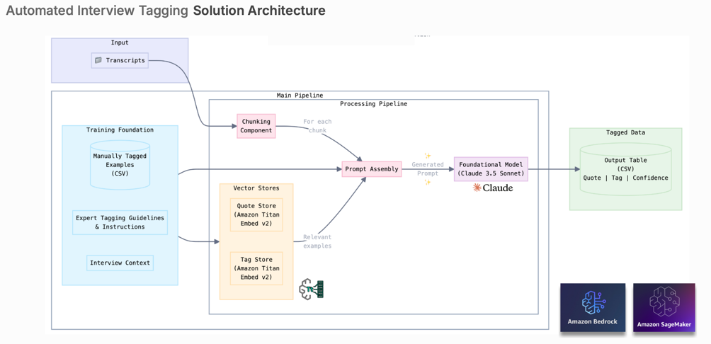

# Sense360: Uncovering User Insights with AI-Powered User Experience Research

This project contains the demo code created for the GH Hackathon 2024.

More info in slides [here](https://docs.google.com/presentation/d/16aaa4hBmB7vca2NhEEbY2Ywal4iMQK9Psrcjtyr54sY/edit#slide=id.g312daf76f76_0_2).

## Solution Architecture
AI-powered automated tagging solution for interview transcripts.
The solution works by taking existing examples of manual tags and guidelines from our experts to teach the model.

Our pipeline breaks down interviews into chunks.
Then using RAG, we retrieve relevant examples from our vector stores and combine them into a prompt for the Claude Foundational Model to deliver AI-powered tagging.

## Owners

| Name           | Role | Email                    |
|----------------|-------|--------------------------|
| Andrea Barraza | Senior Data Scientist | abarraza@grubhub.com     |
| Evelyn Boodaghians | Senior UX Researcher | eboodaghians@grubhub.com |
